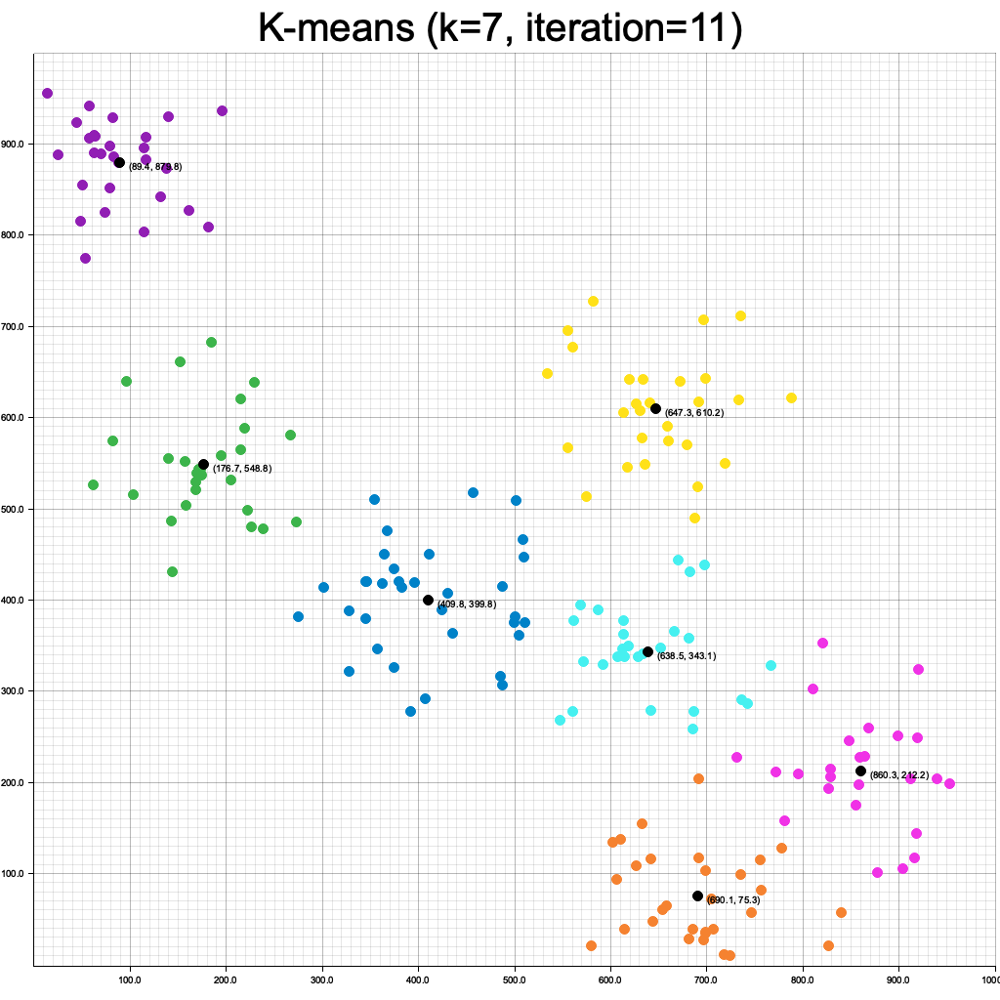

# kmeans-rs
The kind of thing you write when you're learning a new language. Generates JSON or PNG image outputs:

```bash
kmeans-rs 0.4.0

USAGE:
    kmeans-rs [OPTIONS]

OPTIONS:
    -h, --help                         Print help information
    -i, --iterations <ITERATIONS>      [default: 12]
        --json-out
    -k, --k <K>                        [default: 4]
        --lower-bound <LOWER_BOUND>    [default: (0,0)]
    -n, --num-points <NUM_POINTS>      [default: 100]
    -p, --points-file <POINTS_FILE>
        --png-out <PNG_OUT>            [default: kmeans-pngs]
        --upper-bound <UPPER_BOUND>    [default: (1000,1000)]
    -V, --version                      Print version information
```

### Input Examples
Using the `--points-file <PATH>` argument, you can specify your own input points as JSON of the form:
```
[
  {"x": 1, "y": 2},
  {"x:" 3.3, "y": 4.444},
  ...
]
```

### Output Examples

#### PNG
A PNG image will be written to the directory of your choice, per iteration performed.




#### JSON
If the `--json-out` argument is set, per-iteration JSON output will generated. Example for `./kmeans-rs -i 3 -k 2 -n 5 --json-out | jq .` below:

```json
[
  {
    "iteration": 0,
    "clusters": [
      {
        "centroid": {
          "x": 204.68102917360198,
          "y": 125.59145495746793
        },
        "cluster": [
          {
            "x": 126.25833283961363,
            "y": 197.12052782782075
          },
          {
            "x": 101.5768337257652,
            "y": 327.1091042830653
          }
        ]
      },
      {
        "centroid": {
          "x": 621.242956649389,
          "y": 577.3219171423265
        },
        "cluster": [
          {
            "x": 957.4592280885727,
            "y": 700.1990647864401
          },
          {
            "x": 707.9621359286181,
            "y": 458.7304407940045
          },
          {
            "x": 780.4649937996492,
            "y": 106.08892668661795
          }
        ]
      }
    ]
  },
  {
    "iteration": 1,
    "clusters": [
      {
        "centroid": {
          "x": 815.2954526056133,
          "y": 421.6728107556875
        },
        "cluster": [
          {
            "x": 957.4592280885727,
            "y": 700.1990647864401
          },
          {
            "x": 707.9621359286181,
            "y": 458.7304407940045
          },
          {
            "x": 780.4649937996492,
            "y": 106.08892668661795
          }
        ]
      },
      {
        "centroid": {
          "x": 113.9175832826894,
          "y": 262.11481605544304
        },
        "cluster": [
          {
            "x": 126.25833283961363,
            "y": 197.12052782782075
          },
          {
            "x": 101.5768337257652,
            "y": 327.1091042830653
          }
        ]
      }
    ]
  },
  {
    "iteration": 2,
    "clusters": [
      {
        "centroid": {
          "x": 113.9175832826894,
          "y": 262.11481605544304
        },
        "cluster": [
          {
            "x": 126.25833283961363,
            "y": 197.12052782782075
          },
          {
            "x": 101.5768337257652,
            "y": 327.1091042830653
          }
        ]
      },
      {
        "centroid": {
          "x": 815.2954526056133,
          "y": 421.6728107556875
        },
        "cluster": [
          {
            "x": 957.4592280885727,
            "y": 700.1990647864401
          },
          {
            "x": 707.9621359286181,
            "y": 458.7304407940045
          },
          {
            "x": 780.4649937996492,
            "y": 106.08892668661795
          }
        ]
      }
    ]
  }
]
```

